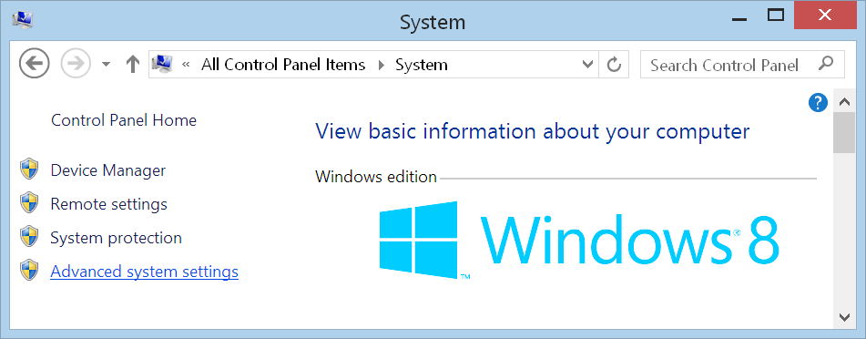
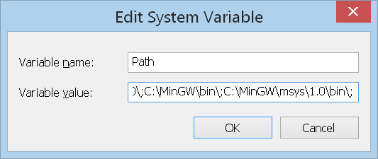
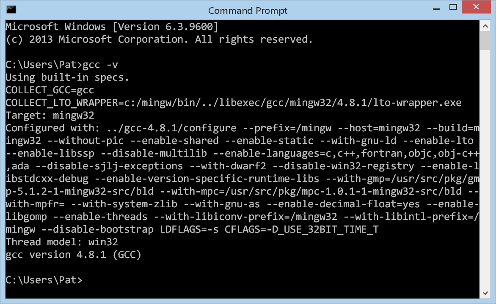

# Installing MinGW on Windows

Go to [MinGW.org](http://mingw.org/) and click the "**Download Installer**"
button in the top right corner.

You will be redirected to **SourceForge.net**, where the download will begin
automatically after a few seconds.

When the download completes, run the installer by either clicking the button in
your browser's downloads toolbar, or navigating to your downloads folder and
double-clicking the installer. The downloaded executable should be named
`mingw-get-setup.exe`

The installer will present you with a welcome screen. Click the **Install**
button at the bottom of this window.

The installer will present you with some options; the defaults are acceptable.
Click **Continue** to begin installation.

After the installer has finished downloading and installing the required
components, click **Continue** to start the **MinGW Installation Manager**

Now that we have **MinGW** installed, we must actually install the packages that
we wish to use with **MinGW**

To tell **MinGW** that we want a particular package installed, we click on the
corresponding checkbox and select **Mark for Installation**

We will install:
 * `mingw32-base`
 * `mingw32-gcc-g++`
 * `msys-base`

After all required packages have been marked for installation, from the **Installation** dropdown menu, select **Apply Changes**

This will bring up a window listing all pending changes. Click the **Apply**
button to begin downloading and installing the selected packages.

Once the Installation Manager has finished installing the selected packages,
click the **Close** button.

The packages have now been installed but, before they can be used, the system's
`PATH` needs to be set to point to **MinGW**

# Setting the System's `PATH`

Open the Control Panel and click the **System** button

Click the **Advanced system settings** link in the left sidebar

Click the **Environment Variables** button at the bottom of the window

The the **System variables** pane in the bottom of the window, scroll to the
**`Path`** variable. Select it, and click the **Edit&hellip;** button

Position your cursor at the very end of the **Variable value** text field, and
type `;C:\MinGW\bin\;C:\MinGW\msys\1.0\bin\`

Click **Ok**

To verify that **MinGW** has been installed and the **`Path`** has been set
correctly, open **`Cmd`** and enter `gcc -v`

You should see **GCC** print some diagnostic information.
